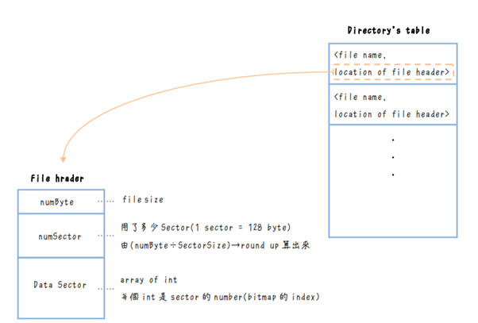
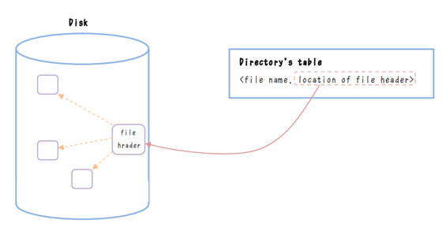

MP4 Report-team55


# MP4 Report

## Team members:

110000205 簡雅雩


110062361李玟顥

| 姓名 |分工 |
|--|--|
|110000205 簡雅雩|Trace code 及report part I, 整理report
|110062631 李玟顥 | Part II, III 實作|


# Part I. Understanding NachOS file system
### (1) How does the NachOS FS manage and find free block space? Where is this information stored on the raw disk (which sector)?

Nachos 在`pbitmap.h` 定義繼承於`Bitmap` 的`PersistentBitmap`，以用來管理freeblock。

```cpp
// pbitmap.h
class PersistentBitmap : public Bitmap{//...
}
```
在filesys.cc中的`FileSystem::FileSystem(bool format)` 中他初始化了`freemap` ，(一個`PersistentBitmap`的instance)，用它來記錄哪個block被使用了(標記為1)，哪個是free的(標記為0)。

從下列code 可知`freemap`儲存在Sector 0
    
```cpp
// filesys.cc
#define FreeMapSector 0
```

其中的”0”就是`freemap的sector number。


### (2) What is the maximum disk size that can be handled by the current implementation? Explain why.

NumSectors = 32*32 = 1024 → 1024*128bytes

在disk.h中，有寫到:
```cpp

//disk.h
const int SectorSize = 128;   // number of bytes per disk sector 
const int SectorsPerTrack  = 32;  // number of sectors per disk track
const int NumTracks = 32;   // number of tracks per disk

```


因此 Sectors的數量 

= (每Track有幾個Sector)*(有幾個Track) 

= SectorsPerTrack*NumTracks 

= 32*32 = 1024個sectors


Bytes = (每Sector幾bytes)*(Sectors的數量) = 128*1024 bytes

----------

### (3) How does the NachOS FS manage the directory data structure? Where is this information stored on the raw disk (which sector)?


在`directory.h` 中，Nachos 定義了`Directory` class和`DirectoryEntry`，class，它們用來管理directory的資料結構。

`Directory` class 中的member`*table`為array of `DirectoryEntry`，用來儲存directory的內容。

而每個`DirectoryEntry`中有`name`，用來儲存file name，`sector`，用來儲存file header的sector number，`inUse`，用來儲存該entry是否被使用。

`class Directory` 提供了一些method，用來管理directory的內容，如`FetchFrom`，`WriteBack`用以從Disk讀取/寫入directory的內容，`Find`用以找到file name對應的sector number，`Add`用以新增file name和sector number，`Remove`用以刪除file name和sector number，`List`用以列舉directory的內容，`Print`用以印出directory的內容。

**Directory 的創建**

Directory儲存在Sector 1，從以下可知

```cpp
// filesys.cc
#define DirectorySector 1
```

其中的”1”就是directory的sector number。

在filesys.cc中會開一個directory，並創建一個FileHeader object，如下

```cpp

// filesys.cc
Directory *directory = new Directory(NumDirEntries);
FileHeader *dirHdr = new FileHeader;

```
然後創出`directory`的FileHeader

```cpp
FileHeader *dirHdr = new FileHeader;
```
之後，首要的是把directory 需佔的sector數量分配出來，並Mark為已使用

```cpp
freeMap->Mark(DirectorySector);
ASSERT(dirHdr->Allocate(freeMap, DirectoryFileSize));
```
之後創建directory 的OpenFile onject，並存到 file system的member `directoryFile`中。

最後把directory的內容寫入disk中

```cpp
directoryFile = new OpenFile(DirectorySector); 
directory->WriteBack(directoryFile);
```

**Directory 的用處**

若在system中創建一個file時會將添加到directory中，在需要開啟file時也會透過directory查找，在刪除file時也會需要更新目錄將該file name刪除，也可以列舉其中的內容。

**讀取Directory**

在創建/刪除/打開file或需要列舉/打印file system時，需要先從disk 讀取directory 的最新內容，這可以透過會呼叫`Directory::FetchFrom` 完成，讀取directory的內容，透過讀取disk上的data將目錄初始化為指定file中的內容。

`Directory::FetchFrom`之中會呼叫ReadAt()從0開始讀取entry然後存儲在table中。
```cpp

// directory.cc
void
Directory::FetchFrom(OpenFile *file)
{
    (void) file->ReadAt((char *)table, tableSize * sizeof(DirectoryEntry), 0);
}
```
例子如在FileSystem::Open()中，會呼叫`Directory::FetchFrom`，讀取directory的內容。
```cpp
// filesys.cc
FileSystem::Open(char *name)
{ 
    //...
    directory->FetchFrom(directoryFile);
}
```

**寫入Directory**

跟讀取一樣，在創建/刪除file時需使用`Directory::WriteBack`，將對目錄的修改寫回disk中。`Directory::WriteBack`會呼叫WriteAt()從0開始將table中的內容寫入disk，以保存對目錄的修改。
```cpp
void
Directory::WriteBack(OpenFile *file)
{
    (void) file->WriteAt((char *)table, tableSize * sizeof(DirectoryEntry), 0);
}
```
例子如在FileSystem::Create()中，完成配後，需呼叫`Directory::WriteBack`，將對目錄的修改寫回disk中。
```cpp
FileSystem::Create(char *name, int initialSize)
{
// filesys.cc
//... work for FS creation
// everthing worked, flush all changes back to disk
    	    	hdr->WriteBack(sector); 		
    	    	directory->WriteBack(directoryFile);
    	    	freeMap->WriteBack(freeMapFile);
}
```


### (4) What information is stored in an inode? Use a figure to illustrate the disk allocation scheme of the current implementation.

Inode是UFS的File control block，也是此處的file header，因此它儲存的資訊有: numBytes(file有多少bytes)、numSector(有多少sector)、dataSector(存在哪個sector)





(5) What is the maximum file size that can be handled by the current implementation? Explain why.

從code中可知:
-   => file header 最多指向`NumDirect` 這麼多個sector
-  `NumDirect` = 30
-  ==> 一個file最多只能有30個sector
-  每sector = 128 Bytes (前面已解釋過)
-  ==> 每個file = 30 * 128 Bytes = 3840 Bytes => 3840/1024 = 3.75KB

此可從以下code得知:
```cpp
// filesys.cc
#define NumDirect  ((SectorSize - 2 * sizeof(int)) / sizeof(int))
//在原本Nachos中，NumDirect = 30
```
